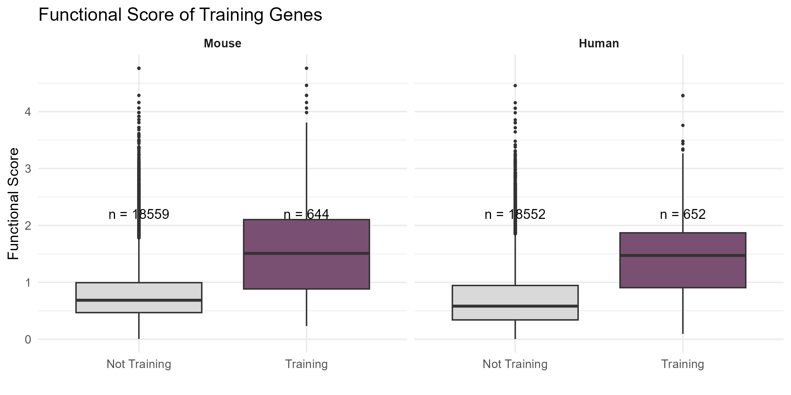

# Epilepsy Meta-Analysis Figure Replication

## Overview

This project was completed as part of a computational biology course and focuses on replicating Figure 2A from the paper *“Meta-analysis of genetic mapping studies in mice reveals epilepsy modifier genes that are outside the current drug development landscape.”*

The study looks at genetic modifier genes that may influence epilepsy susceptibility and severity and explores whether these genes are currently represented in epilepsy drug development.

## What I Did

For this project, I used the data provided by the authors to recreate Figure 2A in R.

I:

* Loaded the functional score and training gene datasets
* Identified training and non-training genes for both mouse and human data
* Organized and filtered the data using `dplyr`
* Created boxplots comparing the functional scores of training and non-training genes
* Combined the mouse and human results into one figure using `ggplot2`

## Replicated Figure

The figure below is my replication of Figure 2A from the study.

The plots compare functional scores between training and non-training genes for mouse and human datasets.

## Technologies

* R
* ggplot2
* dplyr
* tidyr

## Files

* `figure_2a_replication.R` - R code used to process the data and recreate Figure 2A
* `images/figure_2a_combined.png` - Replicated Figure 2A

## Data

The datasets used for this project were obtained from the authors' Epilepsy Meta-Analysis GitHub repository. The analysis uses the functional score dataset (`parsedFPR_info.csv`) and training gene dataset (`training_set.csv`).

The datasets are not included in this repository.

## References

-Durante, G. L., Tyler, A. L., Scott, R. C., Hernan, A. E., & Mahoney, J. M. Meta-analysis of genetic mapping studies in mice reveals candidate epilepsy modifier genes that are outside the current drug development landscape. Epilepsia. Original Paper
-The datasets and original analysis code are available in the authors' GitHub repository:
Epilepsy Meta-Analysis GitHub Repository

## About the Project

This project was completed for BIOL 425, a computational biology course at Hunter College. The goal was to work with data and code from a published biological study and reproduce one of the figures from the original research.
